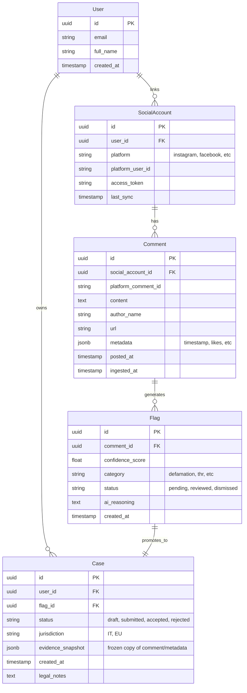

# Haters

**Build a digital startup offering a semi-automated legal service for social media users who receive potentially defamatory or illegal comments.**

## Goal
To empower social media users by providing a streamlined, semi-automated workflow to identify, flag, and legally address defamatory, offensive, or illegal comments.

## Core Interactive Flow
1.  **Connect**: User connects social accounts (IG, FB, YouTube, TikTok).
2.  **Analyze**: System ingests comments and uses AI to flag potential legal violations.
3.  **Review**: User reviews flagged comments in a dashboard (Approve/Ignore).
4.  **Action**: Confirmed cases are generated into legal bundles.
5.  **Resolution**: Partner lawyers verification and formal notice sending.
6.  **Business**: Success-fee based model.

## MVP Scope
*   **User Auth**: Supabase Auth.
*   **Input**: Social platform connection (or CSV upload initially).
*   **Processing**: Comment ingestion, AI classification (OpenAI) for liability/severity.
*   **User UI**: Dashboard for reviewing flags and initiating cases.
*   **Admin UI**: Basic view for legal partners to track cases.
*   **Output**: Structured case file generation.

## Technology Stack
*   **Backend**: Supabase (Postgres, Auth, Storage, Edge Functions).
*   **AI**: OpenAI API (for classification), designed to be provider-agnostic.
*   **Frontend**: (TBD - likely Next.js/React based on modern defaults)
*   **Language**: TypeScript/Node.js.

## Data Model (Initial Design)



## Proposed Folder Structure

```
/
├── .github/                # GitHub workflows/actions
├── src/
│   ├── app/                # Frontend application (Next.js App Router)
│   ├── components/         # Shared UI components
│   ├── lib/                # Shared utilities
│   │   ├── supabase/       # Supabase client & types
│   │   ├── ai/             # AI classification service
│   │   └── social/         # Social media connectors (adapters)
│   └── types/              # Global TypeScript types
├── supabase/
│   ├── migrations/         # Database schema migrations
│   ├── functions/          # Edge functions (e.g. webhook handlers)
│   └── seed.sql            # Local development data
├── public/                 # Static assets
└── tests/                  # Test suite
```
